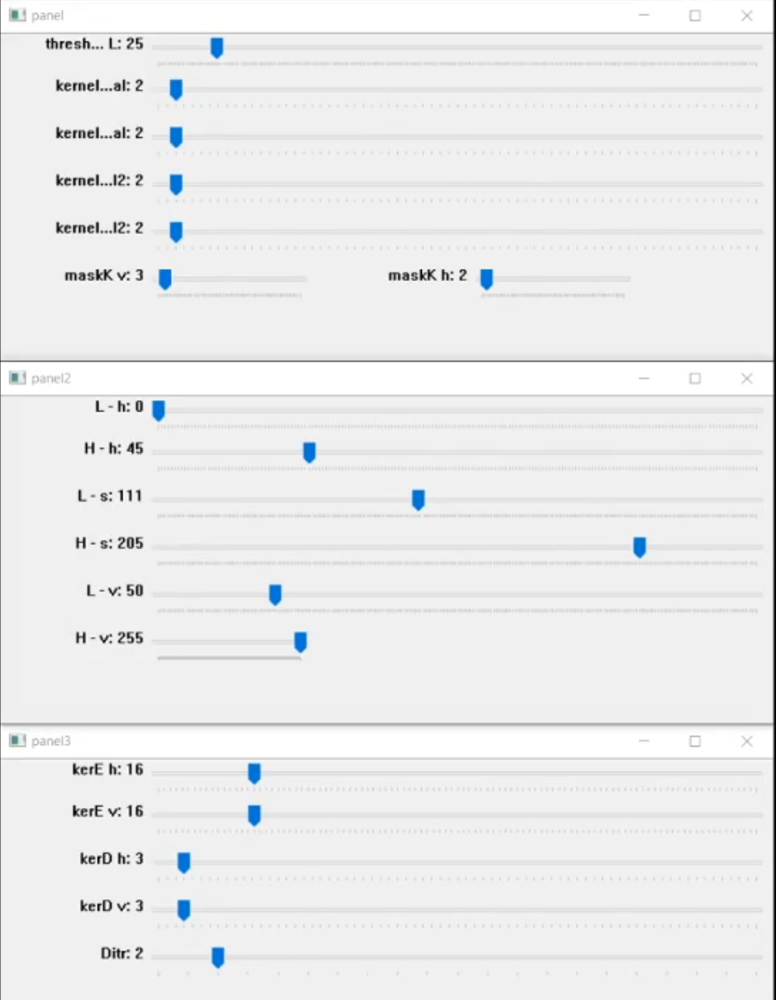

# Aveho
Virtual green screen application built with python3 using open cv2
(complete with OBS chroma key filter for background removal)


----------------------
#    Aveho
----------------------
Aveho (by Roi) was built as a small fast side project in order to give a virtual greenscreen with no real greenscreen to the masses.
Feel free to share and use the code.

Aveho provides you with a virtual green screen you can use in a 3rd party applications like OBS or ZOOM
(hint: look for the chroma key filters and set it to filter green)

Make sure you have pyhon3 installed
In order to run Aveho you will need Aveho.py, production.py and gs_.mp4
If for some reason your camera feed won't show try to switch the number of the camera inside production.py file.

Once you are done tuning Aveho, you can set the masks windows to not pop up the next time. Check the production.py and put '#' before the window you want to hide.

have fun!


```                                               

```        
----------------------
##      How does it work?
----------------------
Aveho combining mainly two filters of cv2, color differentiation, and baseline image differentiation. When Aveho starts, it notify the user to clear the area, than takes a baseline image of the background. Aveho detects differentiation between the camera feed and the base line image, creating a differentiation mask (that I chose to call a shadow mask). Additionally, Aveho creates a color mask using HSV controls. 
In the process, both mask are converted to edges masks (using cv2.canny) and going through additional processing, in order to clear image noise and smooth sharp edges.
Finally, all four masks are combined to create the main mask that differentiate the foreground from the background.


----------------------
##      Controls
----------------------
I have created three control panels that control the image processing
```
- The first panel controls the shadow mask 
- The second panel controls the color mask
- The third panel controls the edge mask
```
Set it the way you like. You can keep the settings you chose as default in the beginning of the code.



----------------------
##      Tips for best results
----------------------
```
- Leave your camera stationary
- Have a controlled lightning environment that lights you from the front, not the side (aka, avoid sunny windows)
- Choose a shirt color that is different from your room’s background
- The green screen will be more precise if the room’s background does not contain any strong change of colors
```


